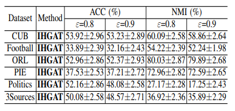
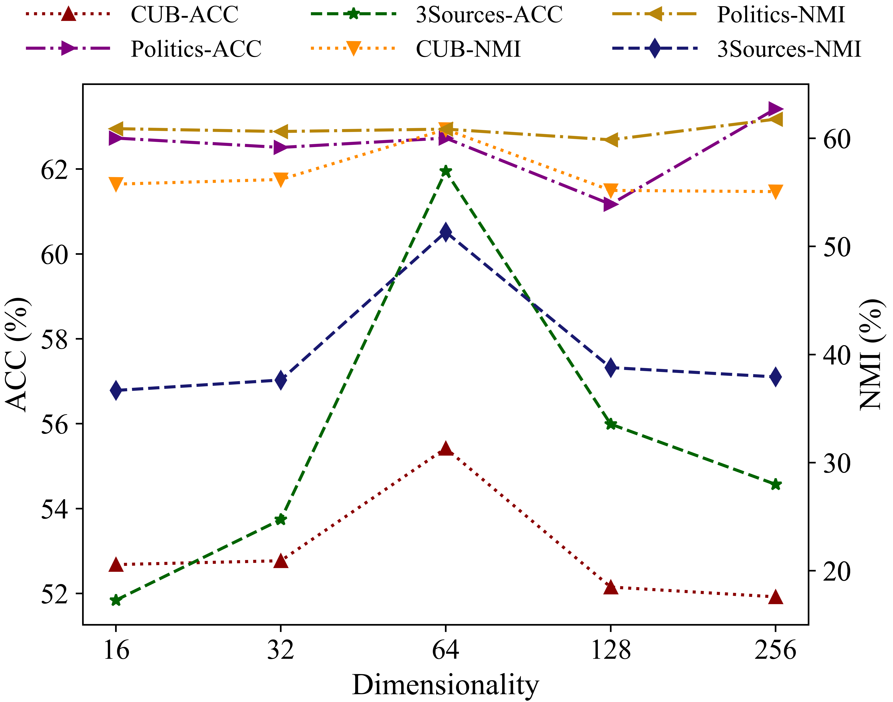

# Integrated Heterogeneous Graph Attention Network for Incomplete Multi-View Clustering  (IHGAT)

The code repository for "Integrated Heterogeneous Graph Attention Network for Incomplete Multi-View Clustering
" (the paper has been submitted to IEEE TIP) in PyTorch.

## Results



Please refer to our [paper](Links will be provided when the paper is published) for detailed values.

## Prerequisites

The following packages are required to run the scripts:

Please see [INSTALL.md](./INSTALL.md)

## Dataset
We provide the source code on six benchmark datasets, i.e., CUB, Football, ORL, PIE, Politics and 3Sources. 

## Code Structures
There are four parts in the code.
 - `models`: It contains the backbone network for the experiment.
 - `data`: .mat format data for the datasets.
 
## Training scripts

- Train CUB

  ```
  python main.py --data cub --gpu 0 --latent_dim 64 --epochs 500 --repeat 100 --lr 0.02 --weight_decay 0.0005 --missing_rate 0.9 --dropout 0.6 --nheads 3 --log_path log_cub_dim64_lr2e-2_wd5e-4_mr9_dr6e-1_nh3_k3.txt
  ```
  
- Train Football
    ```
    python main.py --data football --gpu 0 --latent_dim 64 --epochs 500 --repeat 100 --lr 0.01 --weight_decay 0.0005 --missing_rate 0.9 --dropout 0.3 --nheads 3 --log_path log_football_dim64_lr1e-2_wd5e-4_mr9_dr3e-1_nh3_k10.txt 
    ```

- Train ORL
    ```
    python main.py --data orl --gpu 0 --latent_dim 64 --epochs 500 --repeat 100 --lr 0.02 --weight_decay 0.0005 --missing_rate 0.9 --dropout 0.6 --nheads 3 --log_path log_orl_dim64_lr2e-2_wd5e-4_mr9_dr6e-1_nh3_k5.txt  
    ```

- Train PIE
    ```
    python main.py --data pie --gpu 0 --latent_dim 128 --epochs 500 --repeat 100 --lr 0.01 --weight_decay 0.0005 --missing_rate 0.9 --dropout 0.6 --nheads 3 --log_path log_pie_dim128_lr1e-2_wd5e-4_mr9_dr6e-1_nh3_k5.txt  
    ```

- Train Politics
    ```
    python main.py --data politics --gpu 0 --latent_dim 16 --epochs 500 --repeat 100 --lr 0.02 --weight_decay 0.0005 --missing_rate 0.9 --dropout 0.6 --nheads 3 --log_path log_politics_dim16_lr2e-2_wd5e-4_mr9_dr6e-1_nh3_k10.txt  
    ```

- Train 3Sources
    ```
    python main.py --data 3source --gpu 0 --latent_dim 64 --epochs 500 --repeat 100 --lr 0.02 --weight_decay 0.0005 --missing_rate 0.9 --dropout 0.6 --nheads 3 --log_path log_3source_dim64_lr2e-2_wd5e-4_mr9_dr6e-1_nh3_k5.txt  
    ```

You can change the k value by changing the value of the n_neighbors variable in models/net.py.

  

 
## Acknowledgment
We thank the following work providing helpful components/functions in our work.

- [CPM_Nets](https://github.com/hanmenghan/CPM_Nets/blob/master/util/util.py)


## Contact 
If there are any questions, please feel free to contact with the author:  Xinjie Yao (yaoxinjie@tju.edu.cn). Enjoy the code.
