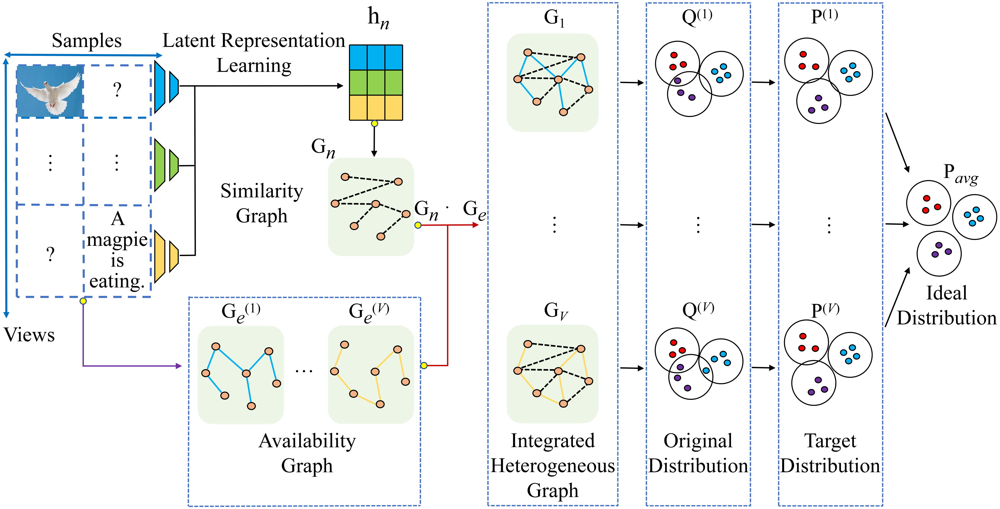
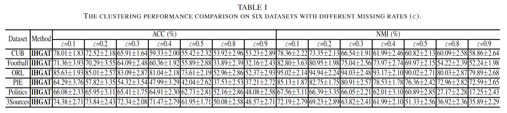

# Integrated Heterogeneous Graph Attention Network for Incomplete Multi-View Clustering  (IHGAT)

The code repository for "Integrated Heterogeneous Graph Attention Network for Incomplete Multi-View Clustering
" (the paper has been submitted to IEEE TIP) in PyTorch.

## Integrated Heterogeneous Graph Attention Network for Incomplete Multi-View Clustering


The architecture of IHGAT requires only a small amount of paired data to model missing views, focusing more on internal structural information rather than using view-completion methods that may introduce noise. Firstly, we construct a set of integrated heterogeneous graphs based on the similarity graph learned from unified latent representations and the view-specific availability graphs obtained by existence relations of different samples. Next, we apply an attention mechanism to aggregate the embedded content of heterogeneous neighbors for each node. Finally, the consistency of probability distribution is embedded into the network for clustering.



## Results


Please refer to our [paper](Links will be provided when the paper is published) for detailed values.

## Prerequisites

The following packages are required to run the scripts:

Please see [INSTALL.md](./INSTALL.md)

## Dataset
We provide the six benchmark datasets, i.e., [CUB](https://www.vision.caltech.edu/datasets/cub_200_2011/), [Football](http://mlg.ucd.ie/aggregation/index.html), [ORL](https://www.cl.cam.ac.uk/research/dtg/attarchive/facedatabase.html), [PIE](http://www.cs.cmu.edu/afs/cs/project/PIE/MultiPie/Multi-Pie/Home.html), [Politics](http://mlg.ucd.ie/aggregation/index.html) and [3Sources](http://mlg.ucd.ie/datasets/3sources.html). 

## Code Structures
There are two parts in the code.
 - `models`: It contains the backbone network for the experiment.
 - `data`: .mat format data for the datasets.
 
## Training scripts

- Train CUB

  ```
  python main.py --data cub --gpu 0 --latent_dim 64 --epochs 500 --repeat 100 --lr 0.02 --weight_decay 0.0005 --missing_rate 0.9 --dropout 0.6 --nheads 3 --log_path log_cub_dim64_lr2e-2_wd5e-4_mr9_dr6e-1_nh3_k3.txt
  ```
  
- Train Football
    ```
    python main.py --data football --gpu 0 --latent_dim 64 --epochs 500 --repeat 100 --lr 0.01 --weight_decay 0.0005 --missing_rate 0.9 --dropout 0.3 --nheads 3 --log_path log_football_dim64_lr1e-2_wd5e-4_mr9_dr3e-1_nh3_k10.txt 
    ```

- Train ORL
    ```
    python main.py --data orl --gpu 0 --latent_dim 64 --epochs 500 --repeat 100 --lr 0.02 --weight_decay 0.0005 --missing_rate 0.9 --dropout 0.6 --nheads 3 --log_path log_orl_dim64_lr2e-2_wd5e-4_mr9_dr6e-1_nh3_k5.txt  
    ```

- Train PIE
    ```
    python main.py --data pie --gpu 0 --latent_dim 128 --epochs 500 --repeat 100 --lr 0.01 --weight_decay 0.0005 --missing_rate 0.9 --dropout 0.6 --nheads 3 --log_path log_pie_dim128_lr1e-2_wd5e-4_mr9_dr6e-1_nh3_k5.txt  
    ```

- Train Politics
    ```
    python main.py --data politics --gpu 0 --latent_dim 16 --epochs 500 --repeat 100 --lr 0.02 --weight_decay 0.0005 --missing_rate 0.9 --dropout 0.6 --nheads 3 --log_path log_politics_dim16_lr2e-2_wd5e-4_mr9_dr6e-1_nh3_k10.txt  
    ```

- Train 3Sources
    ```
    python main.py --data 3source --gpu 0 --latent_dim 64 --epochs 500 --repeat 100 --lr 0.02 --weight_decay 0.0005 --missing_rate 0.9 --dropout 0.6 --nheads 3 --log_path log_3source_dim64_lr2e-2_wd5e-4_mr9_dr6e-1_nh3_k5.txt  
    ```

You can change the k value by changing the value of the n_neighbors variable in models/net.py.

  

 
## Acknowledgment
We thank the following repository providing helpful components/functions in our work.

- [CPM_Nets](https://github.com/hanmenghan/CPM_Nets)


## Contact 
If there are any questions, please feel free to contact with the author:  Xinjie Yao (yaoxinjie@tju.edu.cn). Enjoy the code.
